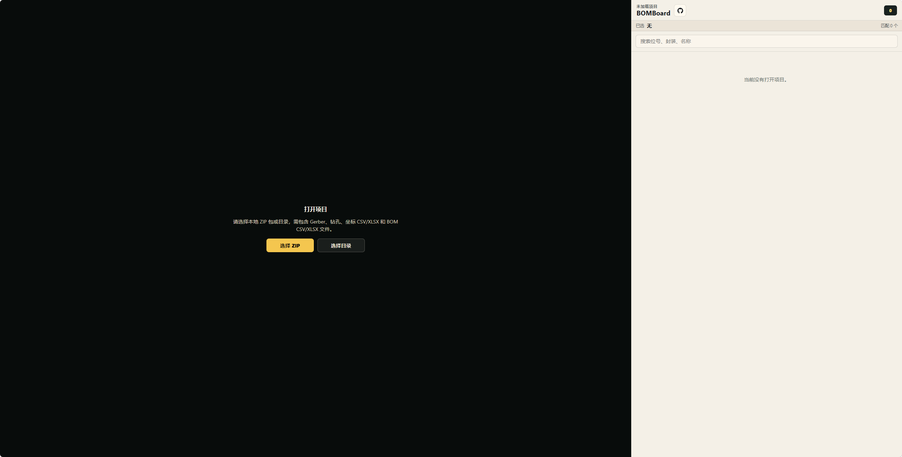
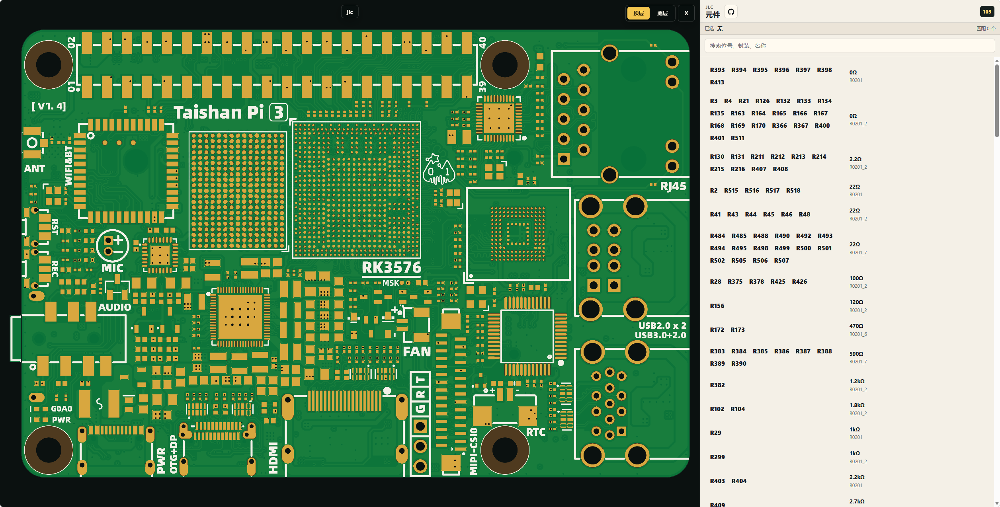
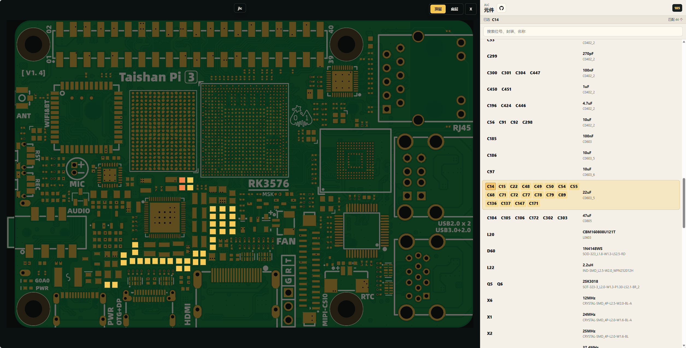
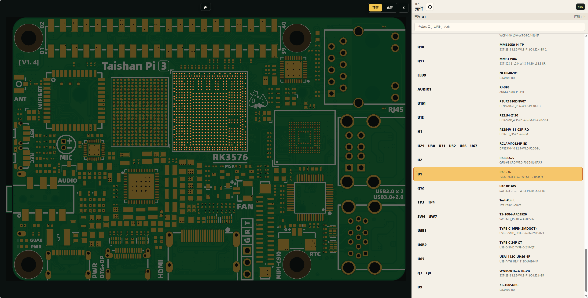

# BOMBoard

[English](./README.md) | 中文

[](https://github.com/donnel666/BOMBoard) [](https://gitee.com/donnel/BOMBoard) [](https://qm.qq.com/q/iBHcSKY3wk) [](./LICENSE)

国内用户建议优先访问 [Gitee 国内仓库](https://gitee.com/donnel/BOMBoard)，下载源码和发布版本会更稳定。

BOMBoard 是一个开源的 PCB 元件定位工具，专为手工贴片和样板焊接场景设计。它完全运行在浏览器本地，无需上传文件，加载 Gerber 文件和 BOM/坐标数据后，即可在渲染出的板图上快速定位元件，帮你“看着板子找位置”，告别反复对图纸的烦恼。

它可以加载本地 ZIP 包或目录，校验项目文件，根据 Gerber 和钻孔数据渲染 PCB，并把板图视图与 BOM、坐标数据关联起来。项目数据会保存在浏览器存储中，刷新页面后可恢复当前工作区，直到用户手动关闭项目。

## 功能

- 支持加载本地 ZIP 包或目录，无需上传到服务器。
- 支持 Gerber 和 Excellon 钻孔文件渲染。
- 支持 BOM CSV/XLSX 和坐标 CSV/XLSX 解析。
- 支持板图视图与元件列表交叉定位。
- 支持按位号、封装、元件名称进行 BOM 模糊搜索。
- 针对常见贴片电阻、电容、电感优化 BOM 排序。
- 根据浏览器语言自动显示中文或英文界面。
- 基于 GPL-3.0 开源。

## 参与贡献

如果遇到解析错误、渲染不一致、封装匹配异常或使用流程问题，欢迎提交 issue：<https://github.com/donnel666/BOMBoard/issues> 🐛

也欢迎提交 PR。无论是改进 Gerber 兼容性、BOM/坐标解析、封装匹配、文档、打包流程，还是优化 UI 细节，都可以直接发起 PR：<https://github.com/donnel666/BOMBoard/pulls> ✨

## 使用教程

请把教程截图放到 `docs/images/` 目录，并使用下面步骤中标注的固定文件名。建议截图尺寸使用 1440x900 或更宽。后续手工替换时保持文件名不变即可。

### 1. 打开 BOMBoard

在浏览器中打开 BOMBoard。进入网站后的首屏会提示选择本地 ZIP 包或目录。文件不会上传到服务器，所有解析都在浏览器本地完成。




### 2. 加载项目

选择本地 ZIP 包或目录。项目中需要包含完整的 Gerber 文件、Excellon 钻孔文件、坐标 CSV/XLSX 文件和 BOM CSV/XLSX 文件。校验通过后，BOMBoard 会渲染 PCB 并列出 BOM 器件。查看器顶部居中会显示当前 ZIP 包名或目录名。



### 3. 按板面定位器件

使用 `顶层`、`底层` 控件切换板面。搜索框为空时，BOM 列表只显示当前板面的器件。需要快速定位时，可以按位号、封装、元件名称搜索。搜索时会同时搜索顶层和底层器件，另一面的结果会带板面标识。

### 4. 高亮同组器件

点击 BOM 中的封装/名称区域，会高亮同组匹配器件。这个操作适合快速找到当前板面上相同类型或相同身份的器件。



### 5. 高亮单个位号

点击 BOM 中的某个位号，或者直接点击 2D 板图中的器件，可以只高亮该器件。右侧 BOM 会自动滚动到选中的器件。如果搜索结果在另一面，点击该结果后，查看器会自动切换到对应板面并选中器件。



### 6. 取消选中或恢复工作区

再次点击已选中的 BOM 项，或点击查看器空白区域，可以取消选中。刷新浏览器会从本地浏览器存储恢复当前工作区。点击板面切换旁边的 `X` 按钮可以关闭项目并清除已保存工作区。

## 环境要求

- Node.js 22 或更高版本
- pnpm 10 或更高版本

## 本地开发

```bash
pnpm install
pnpm dev:web
```

## 校验

```bash
pnpm build
pnpm typecheck
pnpm test
```
